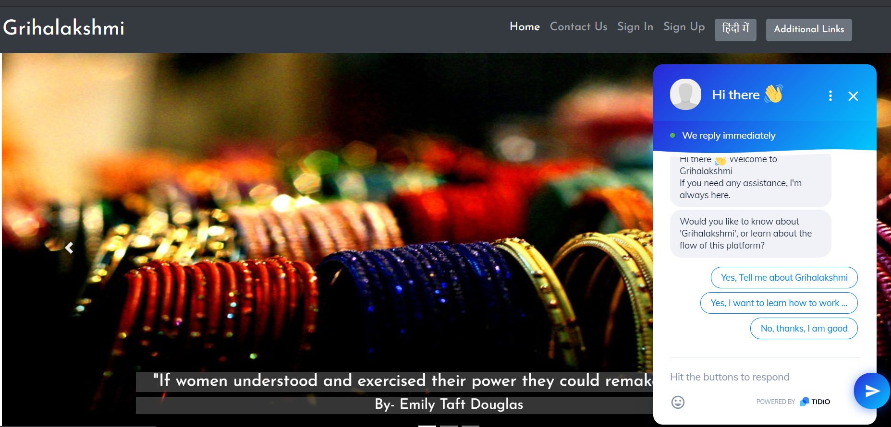
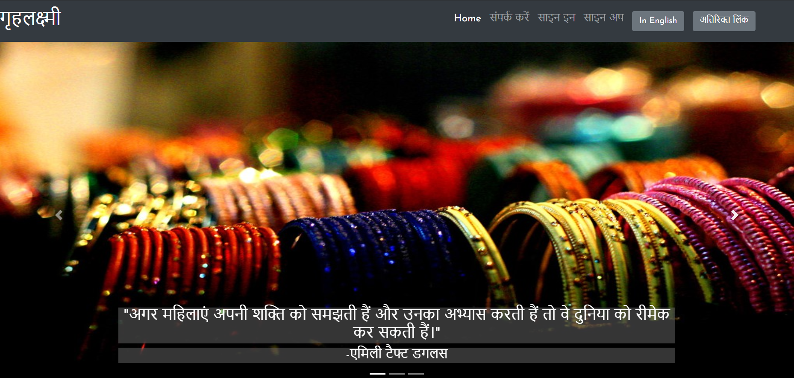
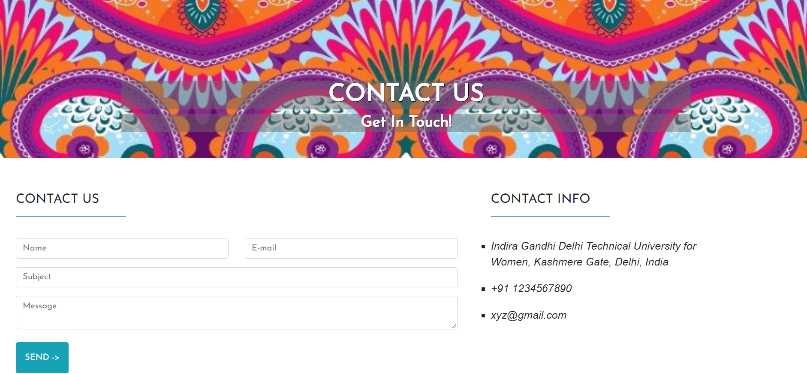

# Grihalakshmi

‘Grihalakshmi’ literally translates to ‘Goddess of the house’. Our aim is to encourage women to be independent and earn their livelihood. We aim to promote women’s community participation and connect those with common skills, by developing a platform to encourage women to interact, learn and develop their skills.

# In Action

This is the main webpage in English

This is the main webpage in Hindi

This is the sign up page

This is the contact us page

# Authors

Amandeep Kaur, Drishti Gupta, Srinidhi Ayyagari, Aayushi Bansal

